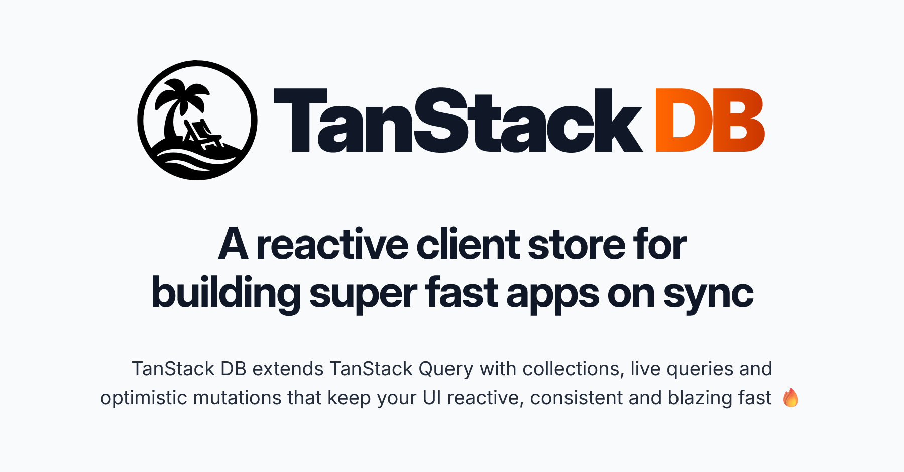

  

 

	
	
	

	
	
	

		
###  [Become a Sponsor!](https://github.com/sponsors/tannerlinsley/)

# TanStack DB

> Tanstack DB is currently in BETA. See [the release post](https://tanstack.com/blog/tanstack-db-0.1-the-embedded-client-database-for-tanstack-query) for more details.

A reactive client store that lets you build fast, sync‑driven apps with a backend‑agnostic real‑time data layer:

- Blazing‑fast query engine for sub‑millisecond live queries, joins & aggregates
- Fine‑grained reactivity to minimize component re‑rendering
- Robust transaction primitives for optimistic mutations with sync & lifecycle support
- Normalized data model that keeps backends simple and consistent

<a href="https://tanstack.com/db" style="font-weight:bold" >Read the docs →</a>
 

## Get Involved

- We welcome issues and pull requests!
- Participate in [GitHub discussions](https://github.com/TanStack/db/discussions)
- Chat with the community on [Discord](https://discord.com/invite/WrRKjPJ)
- See [CONTRIBUTING.md](./CONTRIBUTING.md) for setup instructions

## Partners

<table align="center">
<tr>
<td>
<a href="https://www.coderabbit.ai/?via=tanstack&dub_id=aCcEEdAOqqutX6OS" >
<picture>
  <source media="(prefers-color-scheme: dark)" srcset="https://tanstack.com/assets/coderabbit-dark-CMcuvjEy.svg" height="40" />
  <source media="(prefers-color-scheme: light)" srcset="https://tanstack.com/assets/coderabbit-light-DVMJ2jHi.svg" height="40" />
  
</picture>
</a>
</td>
<td>
<a href="https://www.cloudflare.com?utm_source=tanstack">
<picture>
  <source media="(prefers-color-scheme: dark)" srcset="https://tanstack.com/assets/cloudflare-white-DQDB7UaL.svg" height="60" />
  <source media="(prefers-color-scheme: light)" srcset="https://tanstack.com/assets/cloudflare-black-CPufaW0B.svg" height="60" />
  
</picture>
</a>
</td>
</tr>
<tr>
<td>
<a href="https://electric-sql.com">
<picture>
	<source media="(prefers-color-scheme: dark)" srcset="https://tanstack.com/assets/electric-dark-Bfu2Vl2j.svg" height="60">
	<source media="(prefers-color-scheme: light)" srcset="https://tanstack.com/assets/electric-light-C-5MDda4.svg" height="60">
	
</picture>
</a>
</td>
<td>
<a href="https://www.prisma.io?utm_source=tanstack&via=tanstack">
<picture>
	<source media="(prefers-color-scheme: dark)" srcset="https://tanstack.com/assets/prisma-dark-DwgDxLwn.svg" height="60">
	<source media="(prefers-color-scheme: light)" srcset="https://tanstack.com/assets/prisma-light-Cloa3Onm.svg" height="60">
	
</picture>
</a>
</td>
</tr>
</table>

We're looking for TanStack DB Partners to join our mission! Partner with us to push the boundaries of TanStack DB and build amazing things together.

<a href="mailto:partners@tanstack.com?subject=TanStack DB Partnership"><b>LET'S CHAT</b></a>

## Explore the TanStack Ecosystem

- <a href="https://github.com/tanstack/config"><b>TanStack Config</b></a> – Tooling for JS/TS packages
- <a href="https://github.com/tanstack/devtools"><b>TanStack DevTools</b></a> – Unified devtools panel
- <a href="https://github.com/tanstack/form"><b>TanStack Form</b></a> – Type‑safe form state
- <a href="https://github.com/tanstack/pacer"><b>TanStack Pacer</b></a> – Debouncing, throttling, batching  
- <a href="https://github.com/tanstack/query"><b>TanStack Query</b></a> – Async state & caching
- <a href="https://github.com/tanstack/ranger"><b>TanStack Ranger</b></a> – Range & slider primitives
- <a href="https://github.com/tanstack/router"><b>TanStack Router</b></a> – Type‑safe routing, caching & URL state
- <a href="https://github.com/tanstack/router"><b>TanStack Start</b></a> – Full‑stack SSR & streaming
- <a href="https://github.com/tanstack/store"><b>TanStack Store</b></a> – Reactive data store
- <a href="https://github.com/tanstack/table"><b>TanStack Table</b></a> – Headless datagrids
- <a href="https://github.com/tanstack/virtual"><b>TanStack Virtual</b></a> – Virtualized rendering

… and more at <a href="https://tanstack.com"><b>TanStack.com »</b></a>
v>

<!-- Use the force, Luke -->
